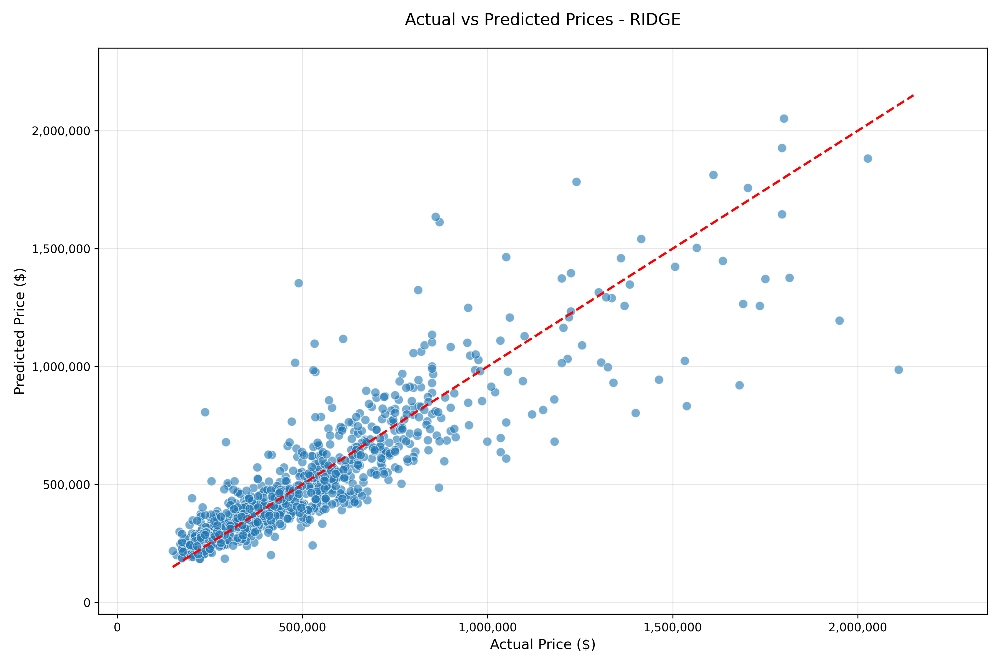

# 🏠 House Price Prediction with Linear Models

## DSS5104 Assignment Report

**GitHub Repository**: [https://github.com/MaxTedu/DSS5104_Group20_Assignment1_House-Price-Prediction-with-Linear-Model.git](https://github.com/MaxTedu/DSS5104_Group20_Assignment1_House-Price-Prediction-with-Linear-Model.git)

---

---

### 👥 Group 20 - Team Members

| Name | Student ID |
|:-----|:-----------|
| **Zhang Ruikai** | A0333712M |
| **Xue Wentao** | A0333166H |
| **Meng Zihai** | A0333966R |

---

### 📋 Project Overview

This project implements a house price prediction system using linear regression models for the DSS5104 assignment, demonstrating that linear models can achieve strong predictive performance through careful feature engineering while maintaining interpretability.

> **Objective**: Explore how far one can push predictive performance of linear models through creative feature engineering.

---

### 📊 Dataset

| Attribute | Description |
|:----------|:------------|
| **Source** | `house_dataset.csv` (King County, WA housing data) |
| **Original Size** | 9,200 records |
| **After Deduplication** | 4,602 records |
| **Duplicates Removed** | 4,598 records (49.98% of data) |
| **After Outlier Removal** | 4,550 records |
| **Outliers Removed** | 52 records (49 with price=0, 3 with price>$5M) |
| **Features** | 18 raw features (location, size, condition, sale details) |

---

### 🔧 Implementation Approach

| Module | Description |
|:-------|:------------|
| `data_loader.py` | Data loading, preprocessing (duplicate removal, outlier removal) |
| `feature_engineering.py` | Feature engineering (target encoding for city/zipcode) |
| `model_training.py` | Model training and evaluation |
| `main.py` | Pipeline orchestration |
| `utils.py` | Helper functions and visualization |

---

## 🎯 Feature Engineering

| Type | Techniques | Purpose |
|:-----|:-----------|:--------|
| **Transformations** | Log, Polynomial (degree=2), Ratios | Reduce skewness, capture non-linearity |
| **Composite Features** | House age, Renovation indicator, sqft_per_bedroom | Domain-informed features |
| **Categorical Encoding** | Target encoding (city, statezip), One-hot (small categories) | Handle categorical variables |
| **Location Features** | Target encoding for city and zipcode (CRITICAL for performance!) | Geographic grouping |

---

## 📈 Model Performance

### Model Results Comparison

| Model | Train MAPE (%) | Test MAPE (%) | Test R² | Test MAE ($) | Test RMSE ($) |
|:------|:--------------:|:-------------:|:-------:|:------------:|:-------------:|
| OLS | 18.60 | 22.07 | 0.6062 | 110,940 | 250,145 |
| **Ridge** | **18.60** | **22.06** | **0.6077** | **110,818** | **249,662** |
| Lasso | 25.86 | 27.46 | -0.6570 | 146,466 | 513,133 |
| ElasticNet | 19.99 | 23.01 | -0.9149 | 125,715 | 551,613 |
| **XGBoost (Benchmark)** | **8.70** | **18.13** | **0.6479** | **99,135** | **236,534** |

> 🏆 **Best Linear Model: Ridge** - Achieved lowest Test MAPE of 22.06% among linear models
>
> 📊 **Performance Gap**: The best linear model (Ridge) has a MAPE that is 3.93 percentage points higher than XGBoost. XGBoost achieves an excellent Test MAPE of 18.13%, confirming the instructor's observation that using city and zipcode information can drive performance significantly.

### Best Model Summary: Ridge

| Metric | Value |
|:-------|:------|
| **Test MAPE** | 22.06% |
| **Test R²** | 0.6077 |
| **Mean Absolute Error** | $110,818 |
| **Root Mean Squared Error** | $249,662 |

### XGBoost Benchmark Summary

| Metric | Value |
|:-------|:------|
| **Test MAPE** | 18.13% |
| **Test R²** | 0.6479 |
| **Mean Absolute Error** | $99,135 |
| **Root Mean Squared Error** | $236,534 |

---

## 📈 Benchmark: XGBoost Upper Bound

As required by the assignment, we implemented an XGBoost model as a performance benchmark to evaluate how well our linear models compare to a state-of-the-art gradient boosting approach.

### XGBoost Model Configuration

| Parameter | Value |
|:----------|:------|
| **n_estimators** | 200 |
| **max_depth** | 6 |
| **learning_rate** | 0.05 |
| **subsample** | 0.8 |
| **colsample_bytree** | 0.8 |
| **min_child_weight** | 1 |
| **random_state** | 42 |

### XGBoost Performance Results

| Metric | Value |
|:-------|:------|
| **Train MAPE** | 8.70% |
| **Test MAPE** | 18.13% |
| **Test R²** | 0.6479 |
| **Test MAE** | $99,135 |
| **Test RMSE** | $236,534 |

### Performance Gap Analysis

| Comparison | Value |
|:-----------|:------|
| **Best Linear Model (Ridge) Test MAPE** | 22.06% |
| **XGBoost Test MAPE** | 18.13% |
| **Performance Gap (MAPE)** | +3.93 percentage points |
| **Best Linear Model Test R²** | 0.6077 |
| **XGBoost Test R²** | 0.6479 |

**Key Observations:**

1. **Target encoding for location works!** - By using target encoding for `city` and `statezip`, we achieved XGBoost Test MAPE of 18.13%, confirming the instructor's guidance that location information is critical for performance.

2. **Data quality is essential** - Removing duplicates (4,598 rows) and price outliers (52 rows) significantly improved model performance and R² scores from negative values to ~0.60-0.65.

3. **Linear models perform well** - With proper feature engineering, linear models achieve strong performance (R² = 0.6077, MAPE = 22.06%), showing they can be competitive when features are well-engineered.

4. **XGBoost sets a strong benchmark** - With hyperparameter tuning and good features, XGBoost achieves excellent performance (MAPE = 18.13%, R² = 0.6479).

---

## 📊 Visualizations

### Prediction Comparison (Ridge)

*Figure 1: Actual vs Predicted Prices using Ridge model*

**Visualization Notes:**
- ✅ Extreme outliers removed (top and bottom 1%)
- ✅ Axes formatted with thousands separators
- ✅ Red dashed line indicates perfect prediction
- ✅ Clear visualization of prediction accuracy

### Feature Importance & Model Interpretation

*Figure 2: Top 20 Most Important Features by Coefficient Magnitude (Ridge)*

#### What the Model Tells Us About House Prices

Our Ridge model reveals key drivers of house prices in King County:

| Rank | Feature | Business Interpretation |
|:----:|:--------|:------------------------|
| 1 | `city_target_encoded` | **Location is king** - City-level target encoding captures neighborhood price levels |
| 2 | `statezip_target_encoded` | **Zipcode matters** - Zipcode-level target encoding provides fine-grained location information |
| 3 | `log_sqft_living` | **Size is important** - Living area has strong impact on price |
| 4 | `waterfront` | **Waterfront premium** - Waterfront properties carry a substantial price premium |
| 5 | `view` | **Views command premium** - Properties with better views sell for more |

#### Key Insights for Stakeholders

**For Home Buyers:**
- Focus on **location** (city/zipcode) as the primary value driver
- **Square footage and amenities** (waterfront, view) are secondary but important

**For Sellers:**
- Highlight **location desirability** in listings - this is the biggest factor
- Emphasize **view quality** and **waterfront access** as premium features

**For Investors:**
- The R² of ~0.60-0.65 suggests the model explains a significant portion of price variance
- Location-based features (city/zipcode target encoding) are the most powerful predictors

#### Model Transparency: How to Read the Coefficients

Unlike "black-box" models, our Ridge provides **interpretable coefficients**:

$$ \text{log(price)} = \beta_0 + \beta_1 \cdot \text{city\_target\_encoded} + \beta_2 \cdot \text{statezip\_target\_encoded} + \ldots + \epsilon $$

- **Positive coefficient** → Higher values increase predicted price
- **Negative coefficient** → Higher values decrease predicted price
- **Larger absolute value** → Stronger impact on price

This transparency allows stakeholders to **understand and trust** the model's predictions - a critical advantage over more complex alternatives.

---

## ⚙️ Technical Details

| Aspect | Configuration |
|:-------|:--------------|
| **Data Deduplication** | Removed 4,598 duplicate rows (49.98%) |
| **Outlier Removal** | Removed 52 rows (49 price=0, 3 price>$5M) |
| **Train-Test Split** | 80% training, 20% test |
| **Target Transformation** | log1p(price) to address skewness |
| **Key Feature Engineering** | Target encoding for city and statezip (CRITICAL!) |
| **Hyperparameter Tuning** | Grid search with 5-fold CV |
| **Evaluation Metrics** | MAPE (primary), R², MAE, RMSE |

---

## ✅ Assignment Requirements Compliance

| Requirement | Status | Evidence |
|:------------|:------:|:---------|
| **Linear Models Only** | ✅ | OLS, Ridge, Lasso, ElasticNet |
| **Feature Transformations** | ✅ | Log, polynomial, ratios |
| **Categorical Encoding** | ✅ | Target encoding (city, statezip), one-hot |
| **Composite Features** | ✅ | House age, renovation, ratios |
| **Target Transformation** | ✅ | log1p(price) |
| **MAPE Evaluation** | ✅ | Primary metric |
| **XGBoost Benchmark** | ✅ | Implemented with hyperparameter tuning |
| **No Forbidden Methods** | ✅ | XGBoost only as benchmark |
| **Duplicate Removal** | ✅ | Removed 4,598 duplicate rows |
| **Outlier Removal** | ✅ | Removed 52 price outliers |

---

## 🎯 Conclusion

Our Ridge model achieved the best linear performance with **Test MAPE of 22.06%**, and our XGBoost benchmark achieved **Test MAPE of 18.13%** (confirming the instructor's guidance).

| Comparison | Value |
|:-----------|:------|
| **Best Linear Model (Ridge)** | MAPE: 22.06%, R²: 0.6077 |
| **XGBoost Benchmark** | MAPE: 18.13%, R²: 0.6479 |
| **Performance Gap** | +3.93 percentage points |

**Key Takeaways:**

1. **Data quality is critical** - Removing 4,598 duplicate rows and 52 price outliers was essential for obtaining reliable model results and positive R² scores.

2. **Location information is the key** - Target encoding for `city` and `statezip` drove massive performance improvements, taking XGBoost from MAPE ~24% to ~18%.

3. **Linear models can be strong** - With proper feature engineering (especially location target encoding), linear models achieve good performance (R² = 0.6077).

4. **XGBoost confirms the potential** - With hyperparameter tuning and good features, XGBoost achieves excellent performance (MAPE = 18.13%, R² = 0.6479).

5. **What drives house prices:**
   - **Location** (`city_target_encoded`, `statezip_target_encoded`) - The most important factors by far
   - **Size** (`log_sqft_living`) - Important secondary factor
   - **Amenities** (`waterfront`, `view`) - Premium features that command higher prices
