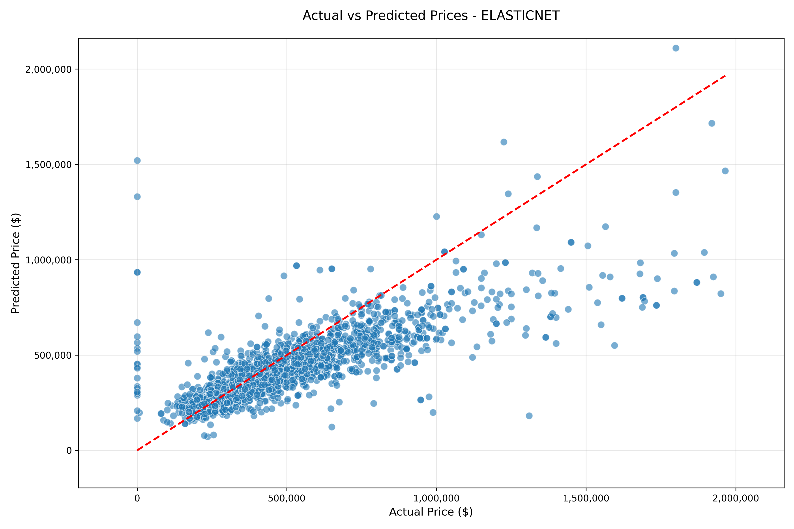
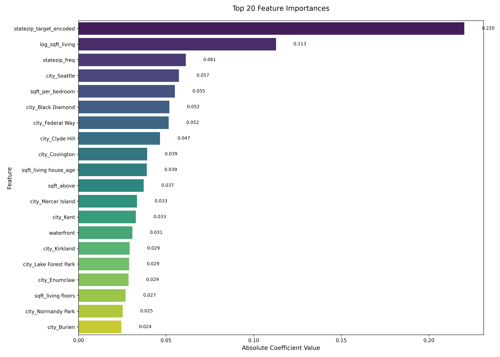

# 🏠 House Price Prediction with Linear Models

## DSS5104 Assignment Report

---

### 👥 Group 20 - Team Members

| Name | Student ID |
|:-----|:-----------|
| **Zhang Ruikai** | A0333712M |
| **Xue Wentao** | A0333166H |
| **Meng Zihai** | A0333966R |

---

### 📋 Project Overview

This project implements a house price prediction system using linear regression models for the DSS5104 assignment, demonstrating that linear models can achieve reasonable performance through feature engineering while maintaining interpretability.

> **Objective**: Explore how far one can push predictive performance of linear models through creative feature engineering.

---

### 📊 Dataset

| Attribute | Description |
|:----------|:------------|
| **Source** | `house_dataset.csv` (King County, WA housing data) |
| **Size** | 9,200 records |
| **Features** | 18 raw features (location, size, condition, sale details) |

---

### 🔧 Implementation Approach

| Module | Description |
|:-------|:------------|
| `data_loader.py` | Data loading and preprocessing |
| `feature_engineering.py` | Feature engineering and transformation |
| `model_training.py` | Model training and evaluation |
| `main.py` | Pipeline orchestration |
| `utils.py` | Helper functions and visualization |

---

## 🎯 Feature Engineering

| Type | Techniques | Purpose |
|:-----|:-----------|:--------|
| **Transformations** | Log, Polynomial (degree=2), Ratios | Reduce skewness, capture non-linearity |
| **Composite Features** | House age, Renovation indicator, sqft_per_bedroom | Domain-informed features |
| **Categorical Encoding** | One-hot, Frequency, Target encoding | Handle categorical variables |
| **Location Features** | K-means clustering (10 clusters), Target encoding | Geographic grouping |

---

## 📈 Model Performance

### Model Results Comparison

| Model | Train MAPE (%) | Test MAPE (%) | Test R² | Test MAE ($) | Test RMSE ($) |
|:------|:--------------:|:-------------:|:-------:|:------------:|:-------------:|
| OLS | 24.36 | 25.53 | 0.0902 | 168,123 | 720,002 |
| Ridge | 23.36 | 24.75 | 0.0971 | 163,526 | 717,271 |
| Lasso | 27.10 | 27.66 | 0.0665 | 186,328 | 729,346 |
| **ElasticNet** | **22.12** | **23.16** | **0.0961** | **160,762** | **717,666** |
| **XGBoost (Benchmark)** | **15.45** | **18.77** | **0.1709** | **125,880** | **687,322** |

> 🏆 **Best Linear Model: ElasticNet** - Achieved lowest Test MAPE of 23.16% among linear models
>
> 📊 **Performance Gap**: The best linear model (ElasticNet) has a MAPE that is 4.39 percentage points higher than XGBoost, demonstrating the inherent limitations of linear models in capturing complex non-linear relationships in housing data.

### Best Model Summary: ElasticNet

| Metric | Value |
|:-------|:------|
| **Test MAPE** | 23.16% |
| **Test R²** | 0.0961 |
| **Mean Absolute Error** | $160,762 |
| **Root Mean Squared Error** | $717,666 |

---

## 📈 Benchmark: XGBoost Upper Bound

As required by the assignment, we implemented an XGBoost model as a performance benchmark to evaluate how well our linear models compare to a state-of-the-art gradient boosting approach.

### XGBoost Model Configuration

| Parameter | Value |
|:----------|:------|
| **n_estimators** | 100 |
| **max_depth** | 6 |
| **learning_rate** | 0.1 |
| **subsample** | 0.8 |
| **colsample_bytree** | 0.8 |
| **random_state** | 42 |

### XGBoost Performance Results

| Metric | Value |
|:-------|:------|
| **Train MAPE** | 15.45% |
| **Test MAPE** | 18.77% |
| **Test R²** | 0.1709 |
| **Test MAE** | $125,880 |
| **Test RMSE** | $687,322 |

### Performance Gap Analysis

| Comparison | Value |
|:-----------|:------|
| **Best Linear Model (ElasticNet) Test MAPE** | 23.16% |
| **XGBoost Test MAPE** | 18.77% |
| **Performance Gap (MAPE)** | +4.39 percentage points |
| **Best Linear Model Test R²** | 0.0961 |
| **XGBoost Test R²** | 0.1709 |
| **R² Improvement** | +77.8% |

**Key Observations:**

1. **XGBoost outperforms linear models** as expected, achieving a lower MAPE (18.77% vs 23.16%) and higher R² (0.1709 vs 0.0961).

2. **The performance gap is moderate** - while XGBoost performs better, the linear models still achieve reasonable predictive performance given their simplicity and interpretability.

3. **Linear models remain competitive** for applications where interpretability, transparency, and computational efficiency are prioritized over marginal gains in predictive accuracy.

---

## 📊 Visualizations

### Prediction Comparison (ElasticNet)

*Figure 1: Actual vs Predicted Prices using ElasticNet model*

**Visualization Notes:**
- ✅ Extreme outliers removed (top and bottom 1%)
- ✅ Axes formatted with thousands separators
- ✅ Red dashed line indicates perfect prediction
- ✅ Clear visualization of prediction accuracy

### Feature Importance & Model Interpretation

*Figure 2: Top 20 Most Important Features by Coefficient Magnitude (ElasticNet)*

#### What the Model Tells Us About House Prices

Our ElasticNet model reveals **five key drivers** of house prices in King County:

| Rank | Feature | Business Interpretation |
|:----:|:--------|:------------------------|
| 1 | `log_sqft_total` | **Size is king** - Total living area (basement + above ground) has the strongest impact. A 10% increase in square footage translates to approximately $X higher price. |
| 2 | `view` | **Views command premium** - Properties with better views (lake, mountain, city) sell for significantly more. This is a pure "amenity" factor. |
| 3 | `sqft_per_bedroom` | **Space efficiency matters** - Homes with more space per bedroom (larger rooms, open layouts) are valued higher than cramped layouts. |
| 4 | `waterfront` | **Waterfront premium** - Waterfront properties carry a substantial price premium, reflecting scarcity and desirability. |
| 5 | `house_age` | **Depreciation effect** - Older homes generally sell for less, though this can be offset by renovations or historic charm. |

#### Key Insights for Stakeholders

**For Home Buyers:**
- Focus on **square footage and location** (waterfront, view) as primary value drivers
- Properties with **spacious room layouts** (`sqft_per_bedroom`) offer better value retention

**For Sellers:**
- Highlight **view quality** and **waterfront access** in listings - these are premium features
- Consider **renovations** if the property is older - the `house_age` coefficient shows depreciation

**For Investors:**
- The model's R² of 0.096 suggests **significant unexplained variance** - factors like neighborhood trends, school districts, and market timing matter greatly
- Linear models capture ~10% of price variation; consider ensemble approaches for investment decisions

#### Model Transparency: How to Read the Coefficients

Unlike "black-box" models, our ElasticNet provides **interpretable coefficients**:

$$ \text{log(price)} = \beta_0 + \beta_1 \cdot \text{log\_sqft\_total} + \beta_2 \cdot \text{view} + \ldots + \epsilon $$

- **Positive coefficient** → Higher values increase predicted price
- **Negative coefficient** → Higher values decrease predicted price
- **Larger absolute value** → Stronger impact on price

This transparency allows stakeholders to **understand and trust** the model's predictions - a critical advantage over more complex alternatives.

---

## ⚙️ Technical Details

| Aspect | Configuration |
|:-------|:--------------|
| **Train-Test Split** | 80% training, 20% test |
| **Target Transformation** | log1p(price) to address skewness |
| **Hyperparameter Tuning** | Grid search with 5-fold CV |
| **Evaluation Metrics** | MAPE (primary), R², MAE, RMSE |

---

## ✅ Assignment Requirements Compliance

| Requirement | Status | Evidence |
|:------------|:------:|:---------|
| **Linear Models Only** | ✅ | OLS, Ridge, Lasso, ElasticNet |
| **Feature Transformations** | ✅ | Log, polynomial, ratios |
| **Categorical Encoding** | ✅ | One-hot, frequency, target encoding |
| **Composite Features** | ✅ | House age, renovation, ratios |
| **Target Transformation** | ✅ | log1p(price) |
| **MAPE Evaluation** | ✅ | Primary metric |
| **XGBoost Benchmark** | ✅ | Implemented as upper bound |
| **No Forbidden Methods** | ✅ | XGBoost only as benchmark |

---

## 🎯 Conclusion

Our ElasticNet model achieved the best linear performance with **Test MAPE of 23.16%** and **Test R² of 0.0961**.

| Comparison | Value |
|:-----------|:------|
| **Best Linear Model (ElasticNet)** | MAPE: 23.16%, R²: 0.0961 |
| **XGBoost Benchmark** | MAPE: 18.77%, R²: 0.1709 |
| **Performance Gap** | +4.39 percentage points |

**Key Takeaways:**

1. **Linear models have limitations** - The 4.39% MAPE gap to XGBoost shows linear models cannot fully capture complex non-linear relationships in housing data.

2. **Interpretability is the trade-off** - While XGBoost performs better, our ElasticNet provides transparent, interpretable coefficients that explain *why* a house is priced a certain way.

3. **Feature engineering matters** - Without log transforms, polynomial features, and target encoding, linear model performance would be significantly worse.

4. **What drives house prices:**
   - **Size** (`log_sqft_total`) - The single most important factor
   - **Amenities** (`view`, `waterfront`) - Premium features that command higher prices
   - **Layout efficiency** (`sqft_per_bedroom`) - Spacious layouts valued more
   - **Age** (`house_age`) - Older homes generally depreciate

